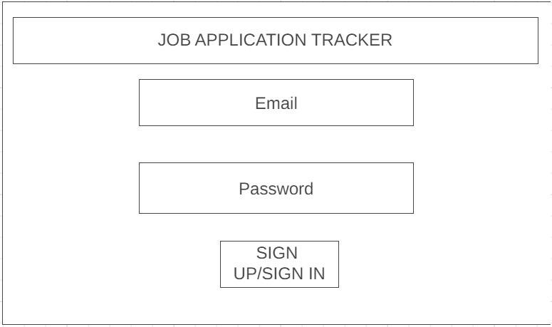
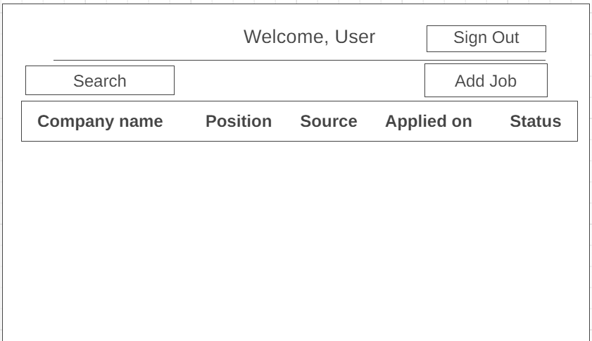

## **JOB APPLICATION TRACKER**
#

## **About the APP :** 
This is a Full Stack web Application built with MERN stack. The way how it's work actually, new user has to sign up for the first time and able to login into application after that. User information will be stored in Mongo DB. 

App is on CRUD operation How Create,READ,Update,& DELETE.

Once users logs in with valid credentials, they track there jobs applied by filling in the details.And get them from dashboard for later use. There is LogOut functionality in the app as well.

Used Postman to check the end points of URL.

**Important information:** 

For Signing up user has to create 6 digit password with special characters .*[@$!%*?&][A-Za-z\d@$!%*?&]{8,}$/

Overall plan of this application is in Trello.

Link to Trello Board =>[Trello](https://trello.com/b/HpDzslKw/mern-stack-app)

### APP => [CRUD APP](https://shilpauday-portfolio.netlify.app/)

#
## **Built With**
#

#
## **Wire frame**
#

# Getting Started with Create React App

This project was bootstrapped with [Create React App](https://github.com/facebook/create-react-app).

## Available Scripts

In the project directory, you can run:

### `npm start`

Runs the app in the development mode.\
Open [http://localhost:3000](http://localhost:3000) to view it in your browser.

The page will reload when you make changes.\
You may also see any lint errors in the console.

### `npm test`

Launches the test runner in the interactive watch mode.\
See the section about [running tests](https://facebook.github.io/create-react-app/docs/running-tests) for more information.

### `npm run build`

Builds the app for production to the `build` folder.\
It correctly bundles React in production mode and optimizes the build for the best performance.

The build is minified and the filenames include the hashes.\
Your app is ready to be deployed!

See the section about [deployment](https://facebook.github.io/create-react-app/docs/deployment) for more information.

### `npm run eject`

**Note: this is a one-way operation. Once you `eject`, you can't go back!**

If you aren't satisfied with the build tool and configuration choices, you can `eject` at any time. This command will remove the single build dependency from your project.

Instead, it will copy all the configuration files and the transitive dependencies (webpack, Babel, ESLint, etc) right into your project so you have full control over them. All of the commands except `eject` will still work, but they will point to the copied scripts so you can tweak them. At this point you're on your own.

You don't have to ever use `eject`. The curated feature set is suitable for small and middle deployments, and you shouldn't feel obligated to use this feature. However we understand that this tool wouldn't be useful if you couldn't customize it when you are ready for it.

## Learn More

You can learn more in the [Create React App documentation](https://facebook.github.io/create-react-app/docs/getting-started).

To learn React, check out the [React documentation](https://reactjs.org/).

### Code Splitting

This section has moved here: [https://facebook.github.io/create-react-app/docs/code-splitting](https://facebook.github.io/create-react-app/docs/code-splitting)

### Analyzing the Bundle Size

This section has moved here: [https://facebook.github.io/create-react-app/docs/analyzing-the-bundle-size](https://facebook.github.io/create-react-app/docs/analyzing-the-bundle-size)

### Making a Progressive Web App

This section has moved here: [https://facebook.github.io/create-react-app/docs/making-a-progressive-web-app](https://facebook.github.io/create-react-app/docs/making-a-progressive-web-app)

### Advanced Configuration

This section has moved here: [https://facebook.github.io/create-react-app/docs/advanced-configuration](https://facebook.github.io/create-react-app/docs/advanced-configuration)

### Deployment

This section has moved here: [https://facebook.github.io/create-react-app/docs/deployment](https://facebook.github.io/create-react-app/docs/deployment)

### `npm run build` fails to minify

This section has moved here: [https://facebook.github.io/create-react-app/docs/troubleshooting#npm-run-build-fails-to-minify](https://facebook.github.io/create-react-app/docs/troubleshooting#npm-run-build-fails-to-minify)

#
## **Future updates**
#

- Search functionality
- Sort functionality
- UI 

#
## **Contribution**
#
If you have a suggestion that would make this game better, please fork the repo and create a pull request. You can also simply open an issue with the tag "enhancement". Thanks again!

- Fork the Project
- Create your New-Feature Branch (git checkout -b New-Feature)
- Commit your Changes (git commit -m 'Add some interesting features')
- Push to the Branch (git push origin New-Feature)
- Open a Pull Request

#
## **Author / Contact**
#
### Shilpa Uday
[GitHub](https://github.com/Shilpashreeau)

[LinkedIn](https://www.linkedin.com/in/shilpashree1)
#
## **Acknowledgements**
#
- https://github.com/AbeTavarez

- https://github.com/Sourabhpande532/Todo-FullStack-Mern-Application

- https://github.com/harsh17112000/crud

